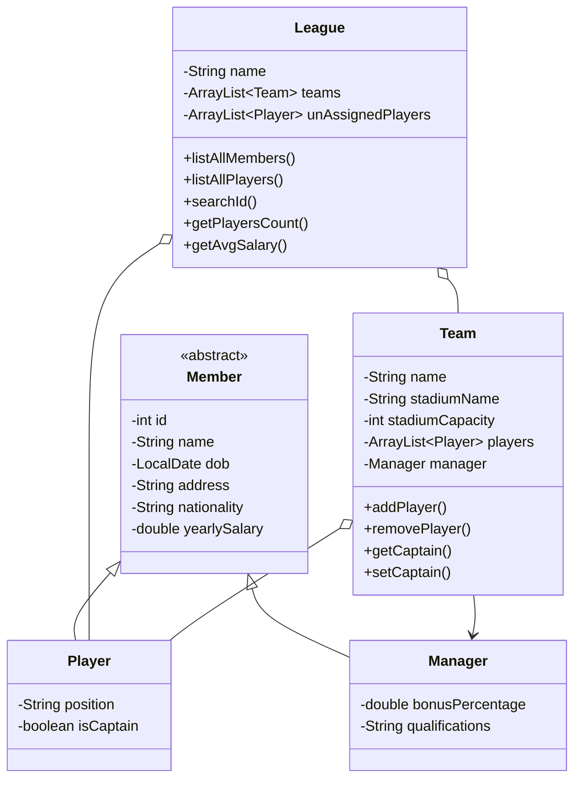

<div align="center">

# Sport League Management System

### Java desktop prototype for modelling teams, players, managers, and league operations

An object-oriented Java project built with Swing and NetBeans to explore inheritance, composition, collections, desktop UI development, and sports-league domain modelling.


</div>

---

## Overview

**Sport League Management System** is a Java desktop application prototype for managing the structure of a sports league.

The project models:

* Leagues
* Teams
* Players
* Managers

and provides a Swing-based interface containing screens for member management, teams, players, managers, reports, and statistics.

The project primarily focuses on object-oriented programming and desktop UI development.

---

## Domain Model

The application's core logic is built around four main classes.



---

## Object-Oriented Design

### Inheritance

`Player` and `Manager` both extend the abstract:

```java
Member
```

class.

Common member information such as:

* ID
* Name
* Date of birth
* Address
* Nationality
* Yearly salary

is therefore maintained in one base class.

### Composition

A `League` contains teams and unassigned players.

A `Team` contains:

* Players
* A manager
* Stadium information

### Comparable

`Member` implements:

```java
Comparable<Member>
```

and compares members using their generated IDs.

### Encapsulation

Collection getters return copied `ArrayList` instances rather than exposing the original internal collection directly.

---

## Team Management Logic

Teams contain:

* Team name
* Stadium name
* Stadium capacity
* Manager
* Player roster

The team model also manages captain assignment.

When a player marked as captain is added to a team, any existing captain is automatically removed so that the team maintains a single captain.

---

## League Operations

The `League` class provides operations for:

* Listing all members
* Listing all players
* Maintaining unassigned players
* Searching for members by ID
* Counting players
* Calculating average member salary
* Managing the league's collection of teams

---

## Desktop Interface

The application uses **Java Swing**.

The main interface contains navigation for:

```text
Dashboard
List All Members
Manage Teams
Manage Managers
Manage Players
Generate Reports
Stats & Analysis
```

The interface also includes forms and dialogs for entering manager information such as:

* Name
* Address
* Date of birth
* Nationality
* Salary
* Bonus percentage
* Team
* Qualifications

---

## Reports UI

The application contains interface screens for:

```text
Yearly Report
Monthly Report
Fortnightly Report
```

as well as export buttons.

These areas were designed as part of the interface prototype, but the report-generation and export actions are not fully implemented in the current version.

---

## Technology

| Area         | Technology           |
| ------------ | -------------------- |
| Language     | Java                 |
| Java Version | Java 19              |
| Desktop UI   | Java Swing           |
| GUI Designer | NetBeans GUI Builder |
| Build System | Apache Ant           |
| IDE          | Apache NetBeans      |

---

## Project Structure

```text
SportLeague/
├── src/
│   ├── GUI/
│   │   ├── SportSystem.java
│   │   ├── SportSystem.form
│   │   └── image/
│   │
│   └── Logic/
│       ├── League.java
│       ├── Manager.java
│       ├── Member.java
│       ├── Player.java
│       └── Team.java
│
├── nbproject/
├── build.xml
└── manifest.mf
```

### `Logic`

Contains the application's object-oriented domain model.

### `GUI`

Contains the Swing application and NetBeans-generated form definition.

---

## Getting Started

### Requirements

* JDK 19
* Apache NetBeans recommended

The project uses NetBeans' Absolute Layout library, so opening it through NetBeans is the easiest way to restore the expected project configuration.

### Clone

```bash
git clone https://github.com/memezsxz/sport-league.git
cd sport-league/SportLeague
```

### Open in NetBeans

In Apache NetBeans:

1. Select **File → Open Project**.
2. Select the `SportLeague` directory.
3. Configure the project to use JDK 19 if required.
4. Allow NetBeans to resolve the Absolute Layout dependency.
5. Run the project.

The configured main class is:

```text
GUI.SportSystem
```

---

## Project Status

This repository is an **academic Java desktop prototype** rather than a production-ready league-management application.

The core object model and Swing navigation are implemented, while several management, reporting, and export workflows remain incomplete.

It is preserved as a learning project demonstrating early experience with:

* Java
* Object-oriented programming
* Inheritance
* Composition
* Collections
* Swing
* NetBeans GUI development
* Desktop application structure
